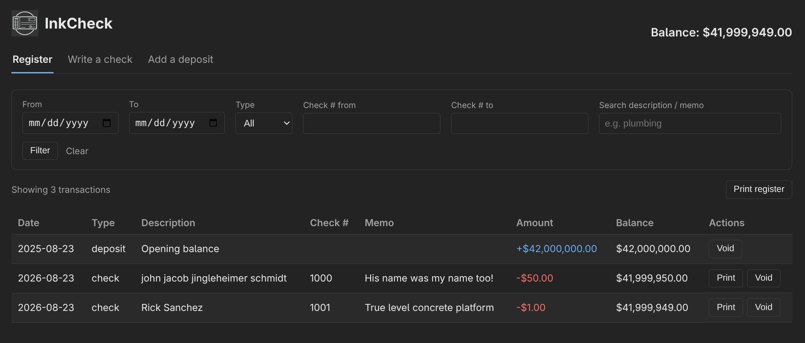
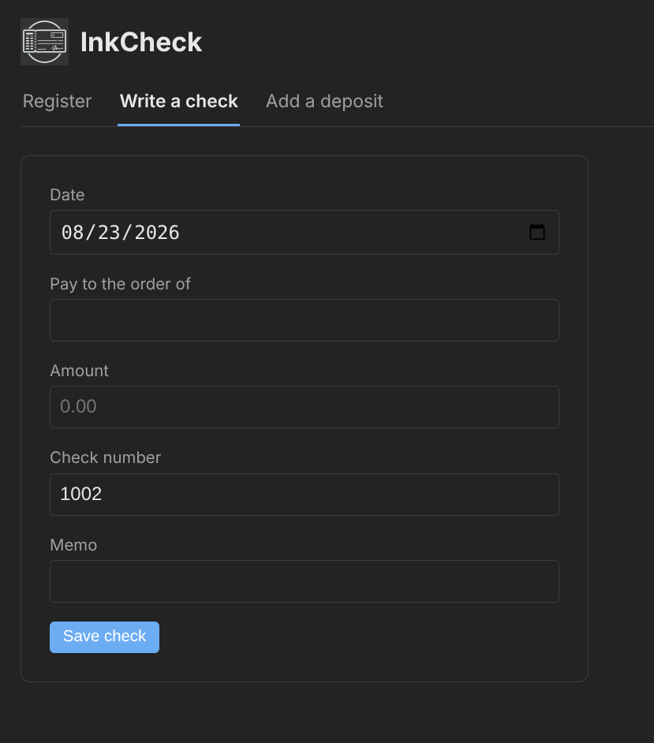
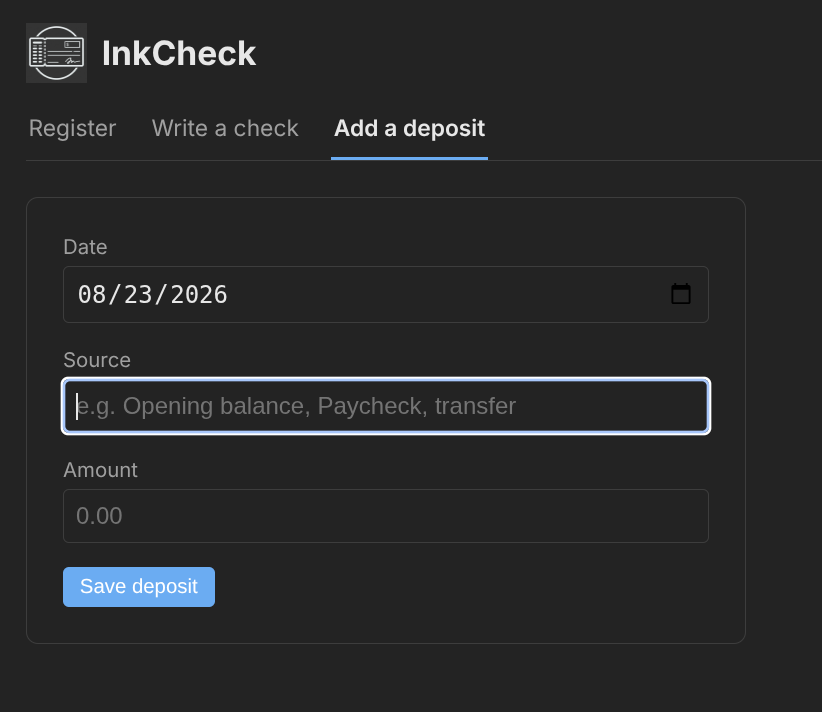
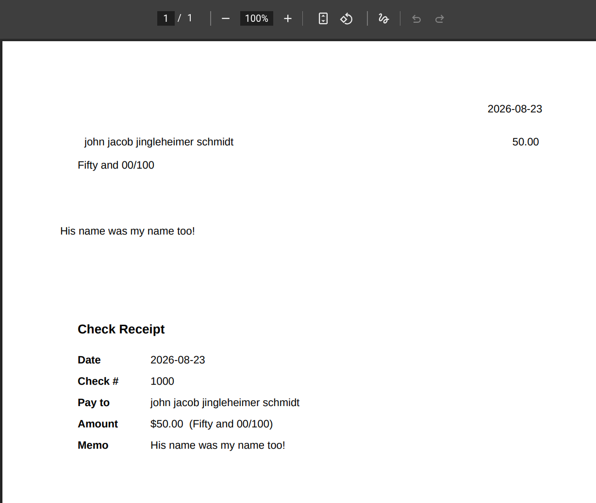
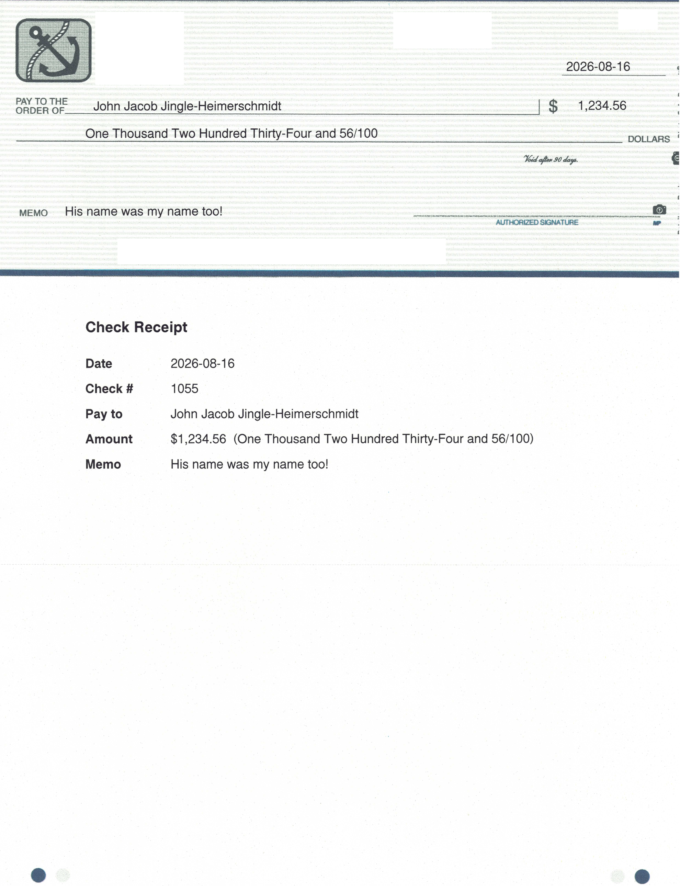

<picture>
  <source media="(prefers-color-scheme: dark)" srcset="static/logo-dark.png">
  
</picture>

# InkCheck

A minimal check register and check-printing web app. Records checks and deposits, keeps a running balance, prints checks onto pre-printed check stock as a positioned PDF, and prints a matching tear-off receipt onto the middle third of the same perforated sheet.

Originally built for my parents who migrated from windows to linux, and needed a way to print checks like they did in quicken, but didnt need full double-entry book-keeping (gnucash).

Templates included work with [Harland Clarke High Security Checks](https://www.costcochecks.com/p/high-security-laser-multi-purpose-check-top/101949?_gl=1*cuv1c3*_up*MQ..*_gs*MQ..*_ga*NjE2NjM1MTQyLjE3ODc1MzgzNDk.*_ga_6QDR43LXTB*czE3ODc1MzgzNDgkbzEkZzEkdDE3ODc1Mzg0MTYkajYwJGwwJGg1MTM2NDc1NzU.&gclid=CjwKCAjwtKrUBhAhEiwAr77Zout6Omq9fK1vTdg_2RGVZPqjAn6PoWhLmJDr0CWXEKi7ahZ3Aqq7BBoC0lEQAvD_BwE&gbraid=0AAAAADxsEME9hsVzSc4StHdxKsZ7XCoSF) from [Costco Checks](https://www.costco.com/f/-/check-services).

No authentication — intended to run behind a reverse proxy (e.g. Traefik) on a trusted internal network.

## Screenshots

<table>
  <tr>
    <td width="50%"><br><sub><b>Register</b> — running balance, filters, and per-row print/void actions.</sub></td>
    <td width="50%"><br><sub><b>Write a check</b> — payee, amount, auto-suggested check number, and memo.</sub></td>
  </tr>
  <tr>
    <td width="50%"><br><sub><b>Add a deposit</b> — source and amount; balance starts at zero.</sub></td>
    <td width="50%"><br><sub><b>Print preview</b> — positioned check face over a tear-off receipt.</sub></td>
  </tr>
</table>

A check printed onto real Harland Clarke stock (account details redacted):



## Run

With the published image (see `docker-compose.yml` for the Traefik labels and volumes):

```
cp .env.example .env   # set INKCHECK_VERSION to pin a release, and INKCHECK_HOST for your domain
docker compose up -d
```

The SQLite database persists to `./data/inkcheck.db` and the layout config is bind-mounted from `./config/`. Uncomment the `ports` block in the compose file to reach it directly without a proxy.

For local development:

```
python3 -m venv .venv && . .venv/bin/activate
pip install -r requirements.txt
python app.py            # http://localhost:8000
```

## Check layout (`config/check_layout.yml`)

Controls where each field is drawn on the printed PDF, in points (1/72"), origin bottom-left. The file is bind-mounted and re-read on every print, so edits apply on the next print with no rebuild or restart. Coordinates were measured from a 600 DPI scan of the real stock; still do one print-and-hold-against-a-check pass to confirm.

- Everything shifted the same way → adjust `offset` once (covers paper-feed drift).
- One field off → edit that field's `x`/`y`.
- `receipt:` controls the middle-third receipt copy (`enabled: false` to skip it).

> The `config/` **directory** is bind-mounted, not the file, on purpose: editors save by writing a new file and renaming over the old one, which swaps the inode and would break a single-file mount.

## Data model

- Money is stored as integer cents, never floats.
- The running balance is computed on read (SQL window function), never stored, so it can't drift from an edit or deletion.
- Voided rows stay in the register (struck through) but drop out of the balance — nothing is ever hard-deleted.
- Balance starts at zero; there's no "opening balance" setting — seed it with a normal deposit.
- Check numbers are user-entered (the app suggests last + 1) and unique. They're tracked in the DB and shown on the receipt, but **not** drawn on the check face — the stock is already pre-printed with them.

## Publishing

`.github/workflows/build.yml` builds the image on push/PR and, on `main` and `v*` tags, publishes it to GHCR with build provenance and an SBOM attestation. A standalone SPDX SBOM is uploaded as a workflow artifact (and attached to the GitHub Release on tags).


## Warranty

This was vibe coded, I'm not a python developer, I only cosplay as one.

TL;DR - Caveat Emptor. There is no warranty express or implied of fitness for a particular purpose.